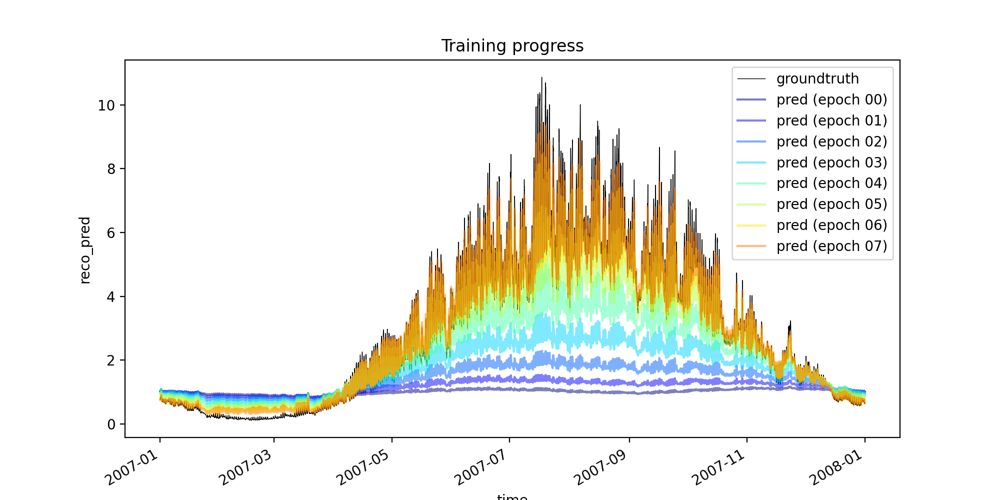
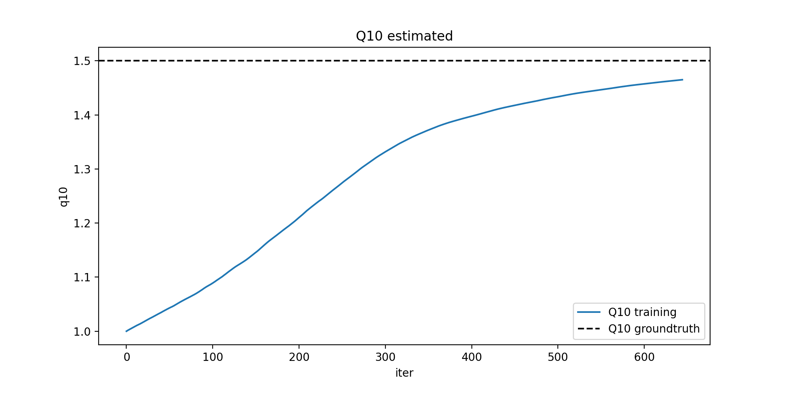

Author: B. Kraft [bkraf@bgc-jena.mpg.de]

## Q10 hybrid modeling experiment

$Rb_\mathrm{syn} = Sf(W_\mathrm{in, pot}, \Delta SW_\mathrm{in, pot})$

$RECO_\mathrm{syn} = Rb_\mathrm{syn} \cdot 1.5^{0.1 \cdot (TA - 15.0)}$

## Experiment 1

[in development]

Estimate Q10 and Rb=NN(SW_in, dSW_in).

#### Usage

Run model: `python train.py`

No options implemented yet, just hybrid model run. Outputs will be written to `lightning_logs/version_xx/`. Predictions are saved as `lightning_logs/version_xx/predictions.nc`.

Use `analysis/analysis.ipynb` for evaluation.

#### First results

## Experiment 2

